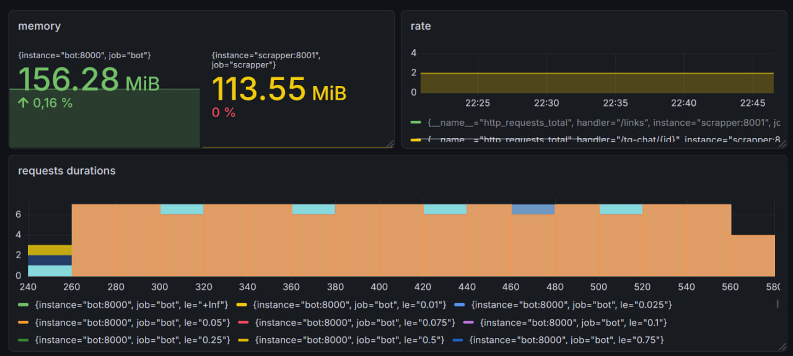
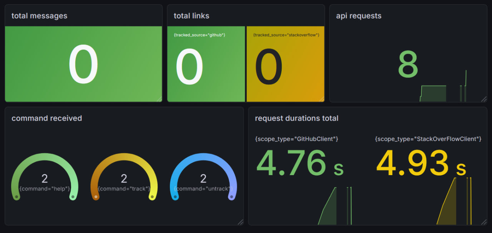

# Link Tracker Monorepo

Монорепозиторий, объединяющий Telegram-бота для управления отслеживаемыми ссылками и backend-сервис для отслеживания изменений на GitHub и StackOverflow.

## Структура проекта

```
project/
├── bot/                  # Telegram бот (Bot-Service)
│   ├── src/              # Исходный код бота
│   └── tests/            # Тесты для бота
├── scrapper/             # Backend сервис (Scrapper-Service)
│   ├── src/              # Исходный код scrapper-сервиса
│   ├── tests/            # Тесты для scrapper-сервиса
│   └── migrations/       # SQL миграции для базы данных
├── agent_service/        # Сервис для обработки обновлений
│   ├── src/              # Исходный код сервиса
│   ├── tests/            # Тесты для сервиса
└── docker-compose.yml    # Файл для запуска всей инфраструктуры
```

## Быстрый старт

### Запуск с помощью Docker (рекомендуемый способ)

1. Создайте файл `.env` в директории `bot/src/secrets/.env`, `agent_service/src/secrets/.env` и `scrapper/src/secrets/.env`, используя примеры `.env_example` в соответствующих папках.
2. Из корня проекта выполните команду:

```bash
docker-compose up --build
```

## Сервисы

### Bot-Service

Telegram-бот для управления отслеживаемыми ссылками. Взаимодействует с пользователем и отправляет запросы в Scrapper-Service.

**Используемые библиотеки:**
- Aiogram
- FastAPI (для вебхуков)
- Uvicorn
- Pydantic
- HTTPX
- confluent-kafka
- tenacity
- aiobreaker

**Основные команды бота:**
- `/track` — диалог добавления ссылки (FSM)
- `/untrack` — удаление ссылки
- `/list [тег]` — список отслеживаемых ссылок с фильтром по тегу

### Scrapper-Service

Backend-сервис, отвечающий за отслеживание изменений на GitHub и StackOverflow.

**Используемые библиотеки:**
- FastAPI
- Uvicorn
- Pydantic
- HTTPX
- asyncpg / sqlalchemy
- Alembic
- confluent-kafka
- tenacity
- aiobreaker

**Работа с базой данных:**
- Поддерживается PostgreSQL.
- Миграции управляются через Alembic.
- Реализованы два способа доступа к данным:
  - **Raw SQL** — низкоуровневый доступ (`access-type=raw`)
  - **ORM** — высокоуровневый доступ через SQLAlchemy (`access-type=raw`)
- Выбор режима работы задается в конфигурации (файл `.env`).

**Кэширование**

Запросы кэшируются для каждого пользователя. Используется in-memory база данных Valkey. Также на стороне scrapper реализован паттерн client side cache.

### Agent-Service

Микросервис для обработки уведомлений.

**Используемые библиотеки:**
- Pydantic
- HTTPX
- confluent-kafka
- tenacity
- aiobreaker

## Общая архитектура

Сервисы могут общаться через HTTP или Kafka:
- `Bot-Service` получает команды от пользователя в Telegram.
- `Bot-Service` отправляет запросы к API или отправляет сообщения в kafka
- `Scrapper-Service` самостоятельно опрашивает внешние ресурсы (GitHub, StackOverflow) по расписанию и отправляет уведомления.
- `Agent-Service` обрабатывает обновления.

Ключевые абстракции в обоих сервисах построены так, чтобы классы не зависели от реализации друг друга и обеспечивали типобезопасность.

## Мониторинг приложения

Мониторинг сделан ввиде при помощи Prometheus и graphana.

**Используемые библиотеки:**
- prometheus-client
- prometheus-fastapi-instrumentator

### Дашборды

#### RED



#### Business


## Тестирование

### Для обоих сервисов

Тесты написаны с использованием `pytest` и `pytest-asyncio`. Внешние API замоканы в фикстурах.

Запуск тестов для конкретного сервиса:

```bash
# Для бота
pytest bot

# Для scrapper-сервиса
pytest scrapper

# Для agent_service
pytest agent_service
```

### Нагрузочное тестирование

Нагрузочное тестирование проведено с помощью jmeter.

В `tests/TestLoad.jmx` jmeter конфиг для проведения тестирования.
В `tests/**.csv` лежат результаты нагрузочного тестирования.

### Интеграционное тестирование (Scrapper-Service)

Для `Scrapper-Service` реализованы тесты с использованием `Testcontainers`, которые поднимают реальные экземпляры PostgreSQL и проверяют корректность работы с БД.

Для запуска интеграционных тестов:

```bash
pytest tests
```

Убедитесь что docker запущен


**Основные переменные окружения:**
- `BOT_TOKEN` — токен Telegram бота.
- `SCRAPPER_URL` — URL для доступа к API Scrapper-Service.
- `DATABASE_URL` — строка подключения к PostgreSQL (для Scrapper-Service).
- `ACCESS_TYPE` — тип доступа к БД (`raw` или `orm`) (для Scrapper-Service).
- `NOTIFICATION_TYPE` - тип общения сервисов (`http` или `kafka`)
